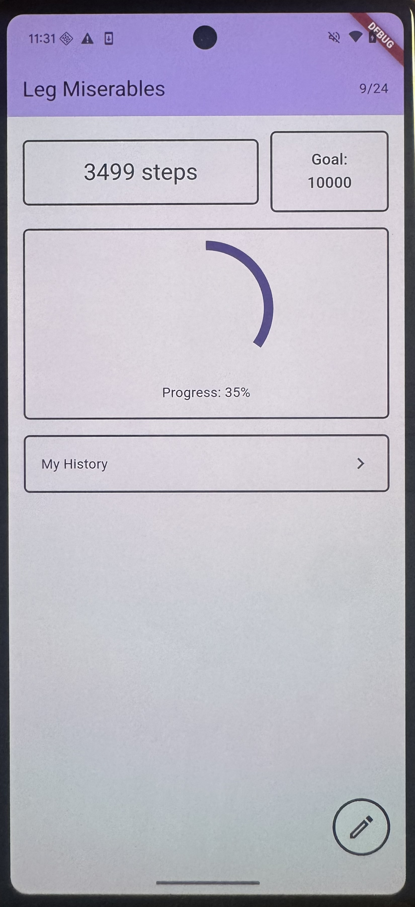
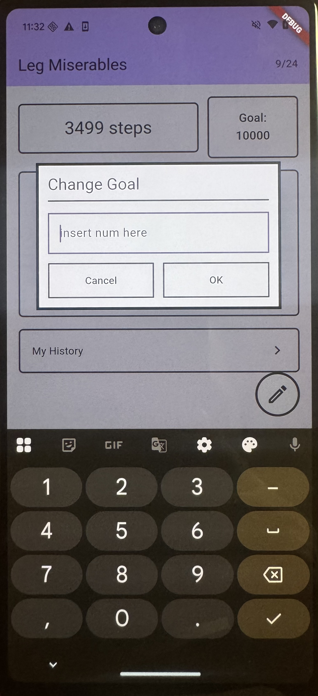
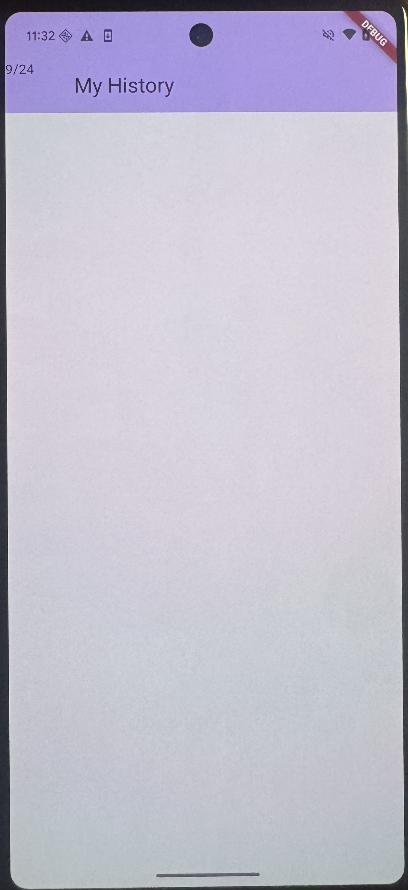

# Leg Miserables

Leg Miserables is a mobile step-tracking application developed for a Mobile Software Development course.

The app uses the phone's pedometer sensor to track the user's steps and display daily progress toward a personal step goal.

## Audience

This app is designed for people who want a simple way to track their daily walking activity.

It can be useful for users who:

- Want to keep track of how many steps they take each day
- Have a daily step goal
- Want to see how close they are to reaching their goal
- Want to review previous step counts

## What the App Does

The application tracks step data using the mobile device's pedometer sensor.

The main page currently includes:

- The name of the application
- The current date
- The number of steps taken today
- The user's daily step goal
- A percentage showing how much of the daily goal has been completed
- A visual progress indicator
- A My History button for navigating to previous step-count data
- An Add/Modify Daily Goal button
- A dialog that allows the user to change their daily step goal

The history page is still under development and will display previous step-count information once completed.

## Why the App Is Useful

Leg Miserables gives users a quick and simple way to monitor their daily physical activity.

Instead of only displaying the number of steps taken, the app also compares the user's progress with a customizable daily goal. This makes it easier for users to understand how much progress they have made throughout the day.

The ability to modify the daily goal also allows different users to set goals that match their own activity level.

## Screenshots

### Home Page

The home page displays today's step count, daily goal, progress percentage, navigation to step history, and the option to modify the daily goal.

### Daily Goal Dialog

The daily goal dialog allows the user to enter and update their personal step goal.

### History Page

The history page will display previous daily step counts.

## Technologies Used

- Flutter
- Dart
- Pedometer package
- Mobile device step sensor

## Project Status

The main step-tracking page is implemented.

The history page is currently under development.

## License

This project includes a LICENSE file describing the terms under which the application may be used and distributed.
